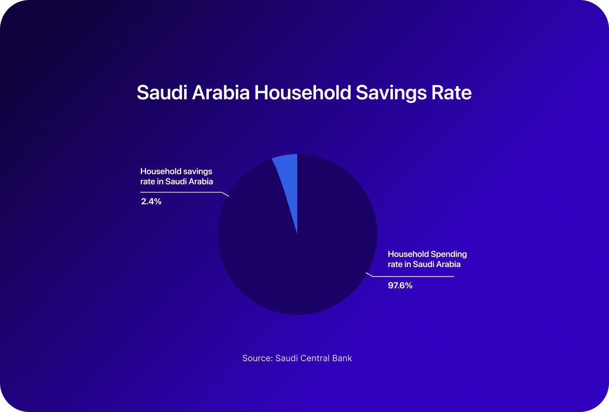
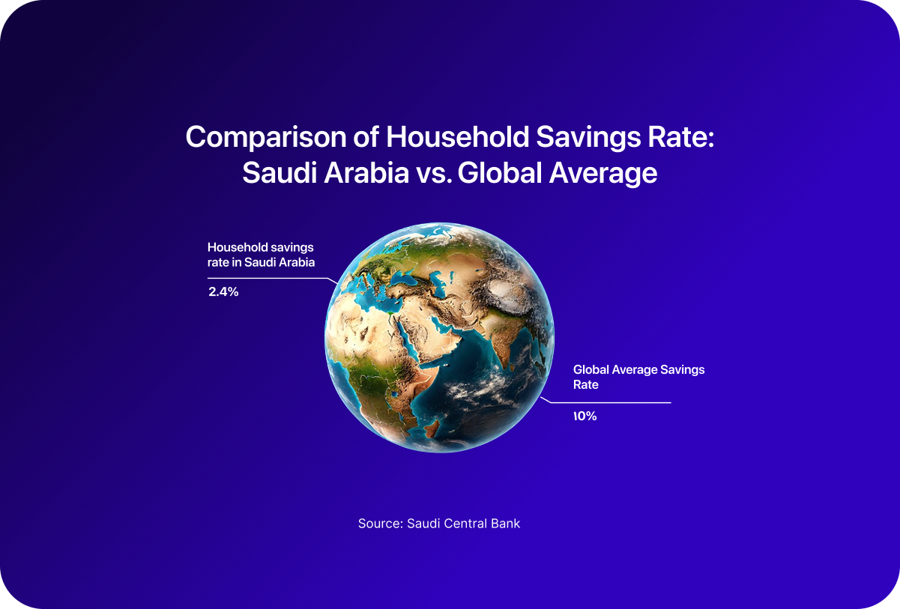
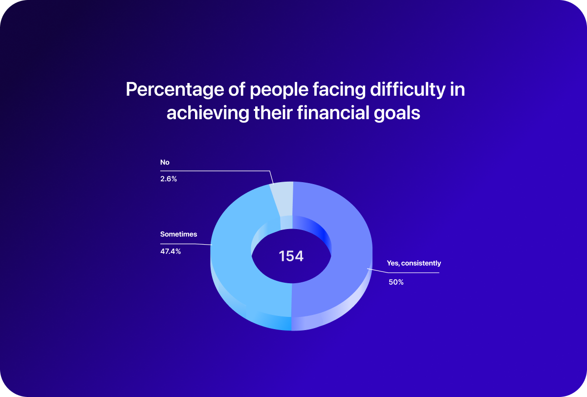
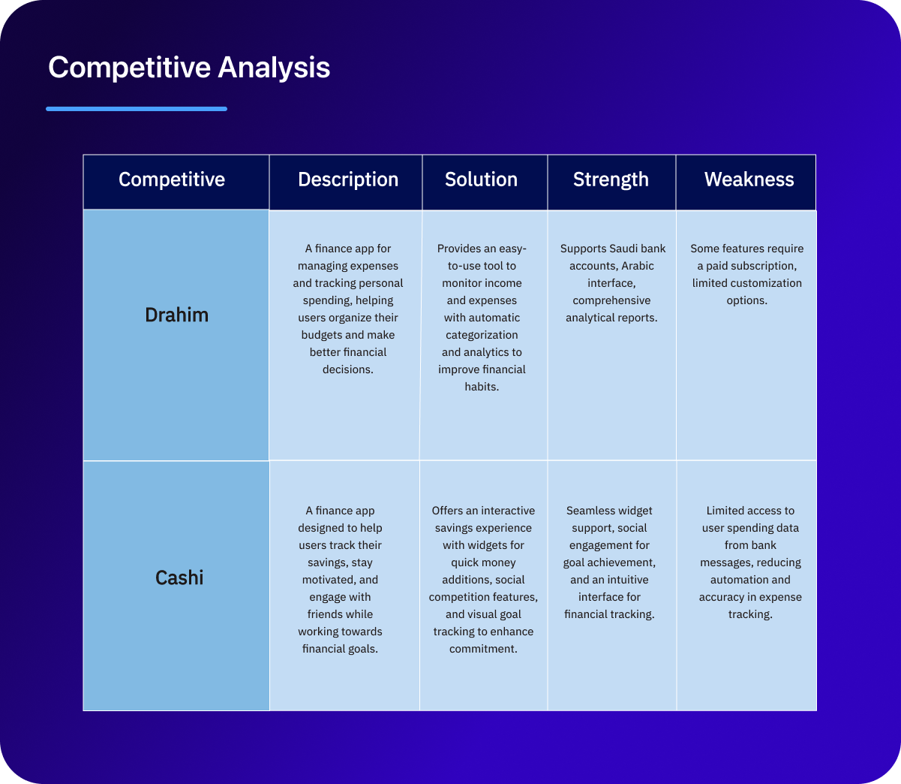
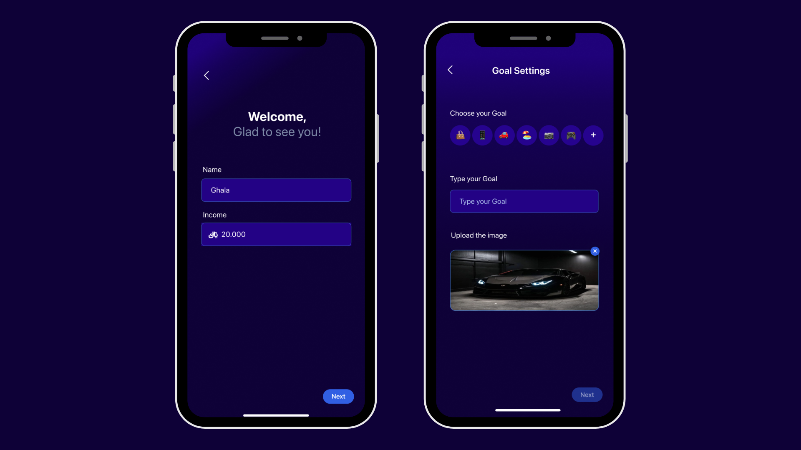
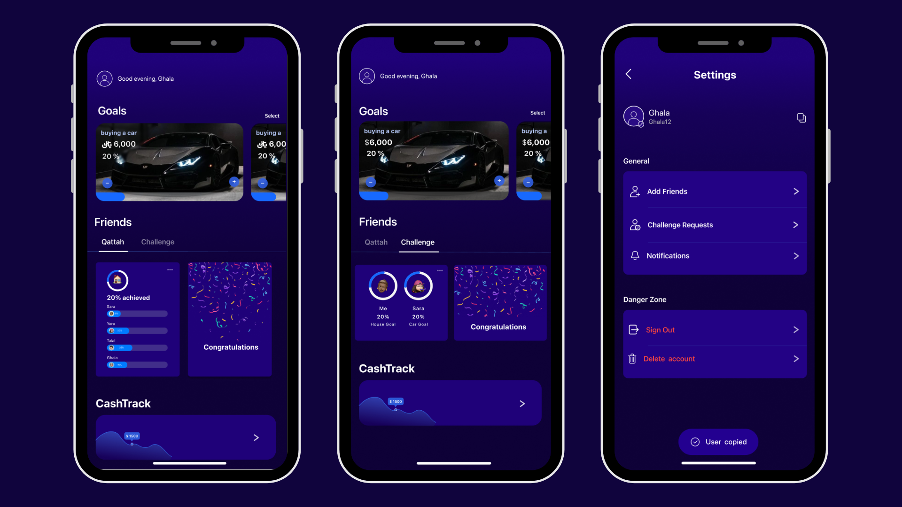

# 💰 Cashi – Financial Goal Tracker App

**Cashi** is an iOS app that helps users achieve their financial goals by **visually tracking their savings** and providing **motivating progress updates**. It’s designed to make saving money more engaging, social, and personalized through visual tools, social comparison, and gamified challenges.

---

## 📊 Key Statistics

### Saudi Arabia Household Savings Rate

### Comparison of Household Savings: Saudi Arabia vs Global Average

### Difficulty in Achieving Financial Goals

> Source: Saudi Central Bank

---

## 🧠 User Insights

Interviews with potential users revealed that:
- They want to **track savings visually** to stay motivated.
- Seeing **friends’ progress** encourages healthy competition.
- They struggle with consistency and want a **simplified saving experience**.

---

## 🆚 Competitive Analysis

| App        | Focus                          | Solution                             | Strengths                                  | Weaknesses                      |
|------------|--------------------------------|--------------------------------------|--------------------------------------------|---------------------------------|
| **Drahim** | Expense & budget tracking       | Auto-categorization, reports         | Supports Saudi banks, Arabic UI            | Some features are paid          |
| **Cashi**  | Saving goals + social features  | Widgets, visual tracking, gamified   | Motivating design, fun UI, social elements | Limited bank integration        |

---

## 📱 App Screens

### Setup & Goal Tracking

### Friends & Progress

---

## 💡 App Statement

> *An app that helps users who want to achieve their financial goals by visually tracking their savings and providing motivating progress updates.*

---

## 👥 Contributors

- [@ghalaghaa](https://github.com/ghalaghaa)
- [@NoufAlfaris](https://github.com/NoufAlfaris)
- [@yarasharari](https://github.com/yarasharari)
- [@shahad-24](https://github.com/shahad-24)

---

## 📂 File Structure

Make sure the following images are placed inside the `images/` folder:

| File Name                 | Purpose                         |
|--------------------------|---------------------------------|
| saving-rate.png          | Saudi savings rate graph        |
| global-comparison.png    | Comparison with global average  |
| financial-difficulty.png | Survey on financial struggle    |
| user-insights.png        | Feedback from users             |
| competitive-analysis.png | Table comparing apps            |
| screens-1.png            | Screens 1 & 2 combined          |
| screens-2.png            | Screens 3, 4 & 5 combined       |

---

## 🔒 License

This project is for educational and demonstration purposes only.
